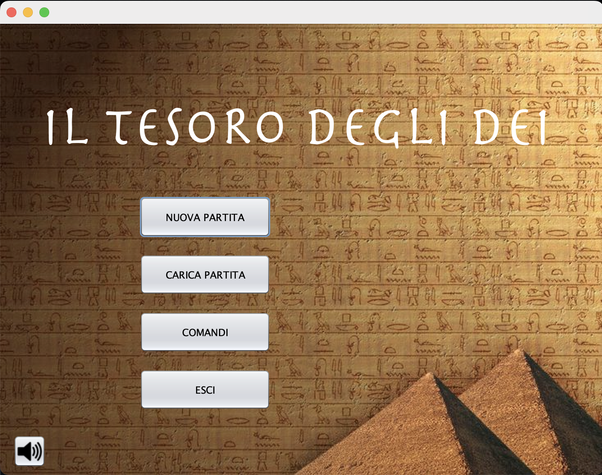
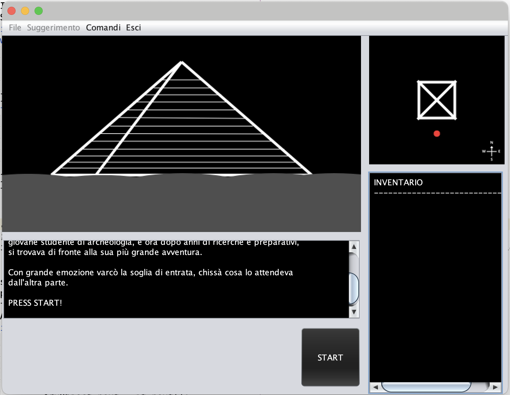
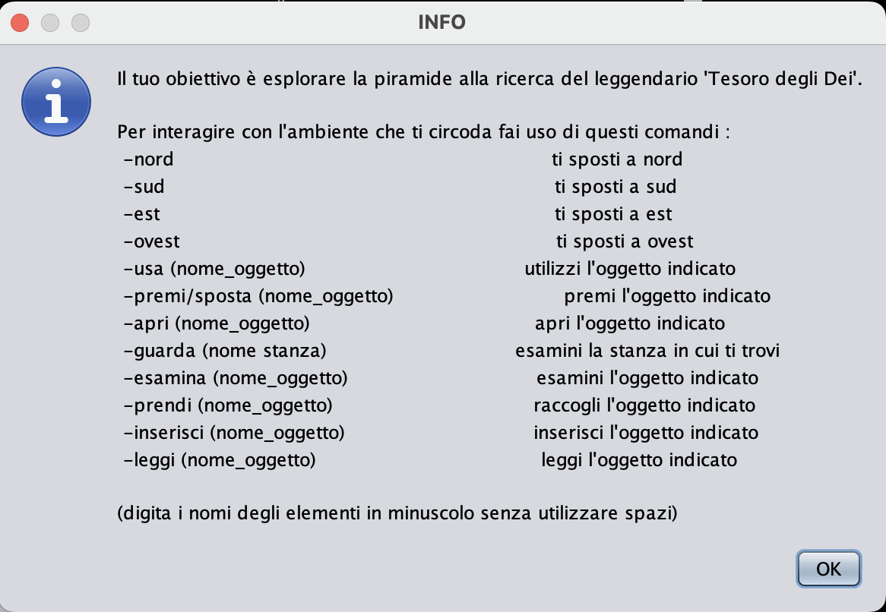
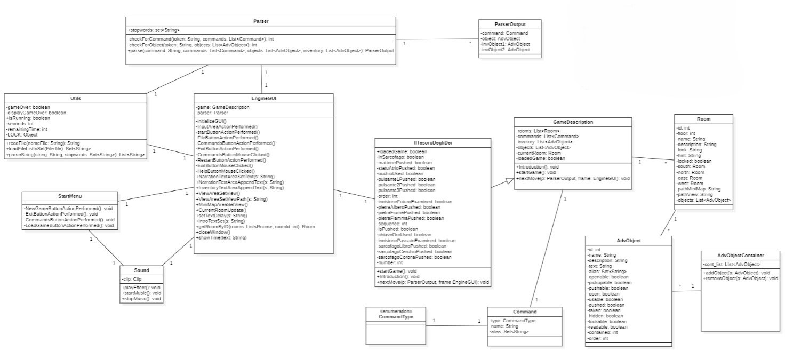
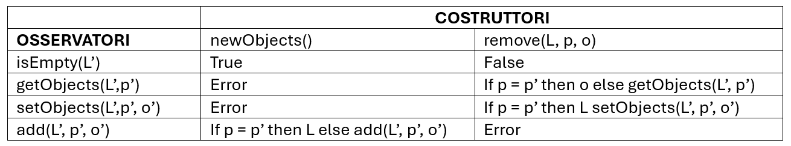

# Documentazione
## Indice
- [1. Componenti del gruppo]( #1-componenti-del-gruppo)
- [2. Descrizione caso di studio]( #2-descrizione-caso-di-studio)
- [3. Diagramma delle classi]( #3-diagramma-delle-classi)
- [4. Specifica Algebrica]( #4-specifica-algebrica)
- [5. Applicazione degli argomenti del corso]( #5-applicazione-degli-argomenti-del-corso)
- [6. Spoiler]( #6-spoiler)
### 1. Componenti del gruppo 
- Gabriele Paladini
- Leonardo Moro
- Domenico Scalise
### 2. Descrizione caso di studio
Il caso di studio da noi sviluppato ha come oggetto l’avventura testuale denominata “Il tesoro degli Dei”: essa è ambientata all’interno di una piramide costituita da più stanze, ed ha come obiettivo il ritrovamento del tesoro nascosto nella piramide.

Trovare il tesoro non è affatto semplice: per potersi spostare fra una stanza e l’altra l’utente deve risolvere una serie di enigmi, esaminare attentamente l’ambiente circostante e raccogliere oggetti sparsi per la piramide, i quali sono fondamentali per il completamento delle sfide; ogni particolare è importante!

Data la difficoltà media degli enigmi, per consentire all’utente un’esperienza di gioco fluida si è pensato di introdurre una sezione “spoiler” la quale, se selezionata, consente al giocatore di comprendere la soluzione degli enigmi, permettendogli così di andare avanti col gioco.

Ogni partita può essere salvata e ripresa successivamente selezionando dal menù principale l’opzione “carica partita”.

Ciascuna partita ha una durata complessiva di 30 minuti, stabiliti a seguito di test eseguiti in fase di gameplay: quest’ultimo contiene effetti sonori ed immagini suggestive create appositamente per illustrare gli enigmi e l’ambiente circostante (è possibile visualizzare una mappa che illustra il piano nel quale si trova il giocatore in quell’istante) i quali consentono all’utente di immergersi a pieno nell’avventura.
L’avventura testuale deve essere avviata dalla classe StartMenu e si presenta con la seguente schermata:

Selezionando “nuova partita”, l’utente visualizzerà la classe EngineGui, la quale mostra una introduzione all’avventura e, dopo aver premuto START permetterà di interagire con il gioco.

Come mostrato in figura, al giocatore verrà mostrato un display di output principale, una input area nella quale inserire i comandi, la sezione “inventario” nella quale compariranno gli oggetti raccolti durante la partita e infine la mappa del piano corrente della piramide.
Premendo il tasto “comandi” è disponibile inoltre un elenco di comandi inseribili dal giocatore:

### 3. Diagramma delle classi
Il seguente diagramma delle classi illustra la logica del gioco e rappresenta la parte di codice relativa al funzionamento del comando nextMove.

### 4. Specifica algebrica
    Objects è la lista che contiene tutti gli oggetti di tipo “AdvObject” presenti nel gioco.
    
    Objects: insieme delle sequenze L = <a1, a2, …, an> con n>=0 di elementi di tipo Object (oggetti) dove l’elemento i-esimo ha posizione pos(i) e valore a(i).
    
    Tipi: Objects, position, boolean, object
    
    Operatori:
    -	newObjects() -> Objects 
    -	isEmpty(Objects) -> boolean 
    -	getObjects(Objects, position) -> object 
    -	setObjects(Objects, position, object) -> Objects 
    -	add(Objects, position, object) -> Objects 
    -	remove(Objects, position) -> Objects 
    
    Costruttori di Objects  considerati: newObjects(), remove(L, p).

    
    L = Objects, p = position, o = object

### 5. Applicazione degli argomenti del corso
- **FILE**: sono stati utilizzati per caricare l'intro, la conclusione  e le colonne sonore del gioco. Inoltre, è stato utilizzato un file stopwords contentente tutte le parole che il parser deve ignorare.
- **JDBC**: è stato utilizzato il Database Engine H2 per salvare una partita in corso e i corrispettivi progressi, successivamente il caricamento della partita può essere fatto dal menu.
- **SWING**: è stato utilizzato per la realizzazione delle interfacce grafiche quali, il menu iniziale per dare la possibilità all'utente di iniziare una nuova partita oppure caricare una partita già esistente, visualizzare i comandi disponibili o uscire dal gioco.
- **THREAD**: è stato utilizzato per l'implementazione di un timer utilizzato per impostare il tempo massimo entro il quale l'utente può completare tutte le azioni necessarie al fine di riuscire a completare il gioco. Terminato questo tempo l'utente viene reindirizzato al menu principale.
- **LAMBDA EXPRESSION**: è stata utilizzata per ritardare la stampa del testo attraverso l'utilizzo di un timer.
Quando il timer scatta ad intervalli specifici la lambda expression viene eseguita controllando se l'indice attuale è minore della lunghezza di tutto il testo e in caso positivo estrae la lettera, la stampa ed incrementa l'indice di 1. Questo processo viene eseguito fino a quando non si raggiungere la lunghezza del testo.

Non è stato preso in considerazione l'utilizzo del socket poiché il progetto sviluppato riguarda un applicazione realizzata in singleplayer.

Il sistema è composto da 6 package:
-	di.uniba.it.iltesorodeglidei il quale contiene la classe IlTesoroDegliDei
-	di.uniba.it.map.b.adventure.database il quale contiene la classe Database
-	di.uniba.it.map.n.adventure.gui il quale contiene le classi EngineGUI, Sound, StartMenu
-	di.uniba.it.map.b.adventure.parser il quale contiene le classi Parser e ParserOutput
-	di.uniba.it.map.b.adventure.type il quale contiene le classi AdvObject, AdvObjectContainer,Command, CommandType e Room
-	di.uniba.it.map.b.adventures il quale contiene le classi GameDescription e Utils.

### 6. Spoiler

    Ingresso:
    -	Sposta mattone, troverai una chiave;
    -	Prendi chiave; 
    -	Usa chiaveIngresso per aprire la porta;
    
    Atrio:
    -	Ovest per andare in CorridoioSimbolo;
    -	Prendi simbolo (occhio di Horus);
    -	Est per tornare in Atrio;
    -	Sposta statua;
    -	Prendi simbolo (Ankh);
    -	Per aprire la porta di destra: Usa occhio e poi usa ankh;
    
    SalaStatue:
    -	Sud per andare in SalaIncisione;
    -	Raccogli Torcia;
    -	Esamina Incisione;
    -	Usa Torcia;
    -	Numero su incisione del futuro: 3;
    -	Nord per tornare in SalaStatue;
    -	Nord per andare in CameraSapienza;
    -	Per risolvere l’enigma: premi PietraFiamma - premi PietraAlbero – premi PietraFiume;
    -	Prendi chiave;
    -	Nord e Usa chiave per andare in CameraScrigno;
    
    CameraScrigno:
    -	Apri scrigno;
    -	Esamina incisione;
    -	Usa torcia; 
    -	Numero su incisione del presente: 1;
    -	Sud x2 volte per tornare in SalaStatue;
    -	Usa i due numeri (3 e 1) per risolvere l’enigma:
    -	Premi pulsanteLuna (presente, numero 1) – premi pulsanteSole – premi pulsanteStella (futuro, numero 3);
    -	Est per andare in SalaCripta;
    
    SalaCripta:
    -	Premi sarcofagoLibro – premi sarcofagoCerchio – premi sarcofagoCorona;
    -   Apri sarcofagostella - prendi lente;
    -	Ovest x3 volte per tornare in CorridoioSimbolo;
    -	Ovest per andare in Scale1Piano;
    -	Nord per andare in SalaRitualeAstrale;
    
    SalaRituraleAstrale:
    -	Per aprire la porta a Nord utilizzare la parola chiave “sapere”;
    -	Nord per andare in SalaTesoro;

    SalaTesoro:
    -   Premi secondopilastro;
    -   Apri sarcofago;
    -   Prendi chiave;
    -   Usa chiave;
    -   Nord per andare in Scale2Piano;
    -   Nord per andare in SalaOsservatorio;

    SalaOsservatorio:
    -   Usa lente;
    -   Usa telescopio;

